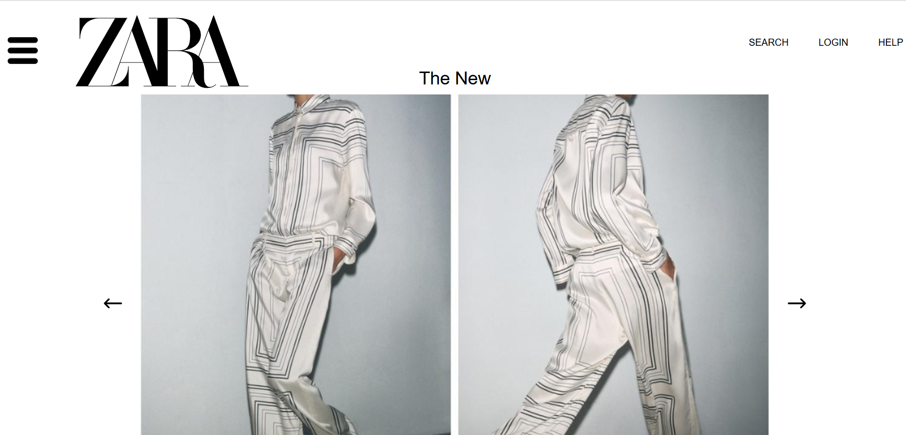
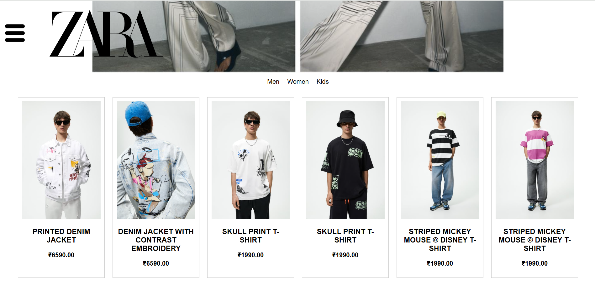
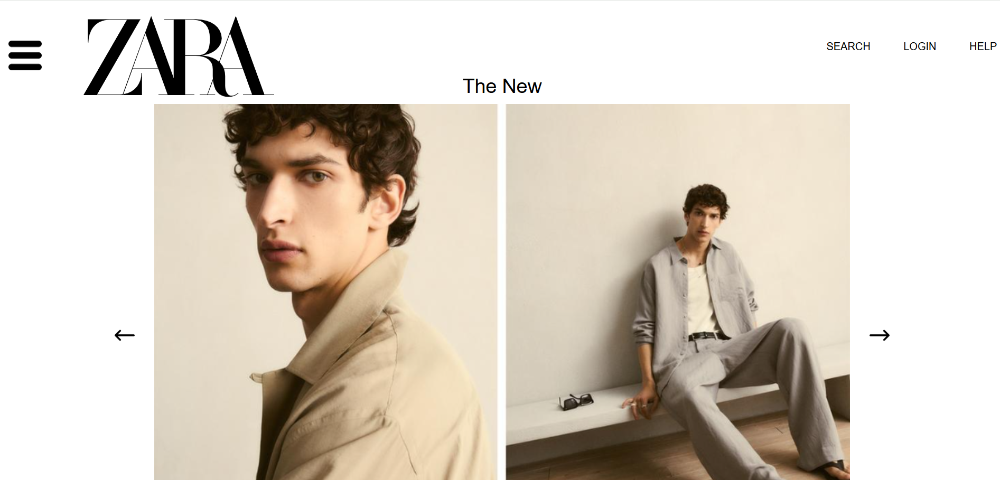
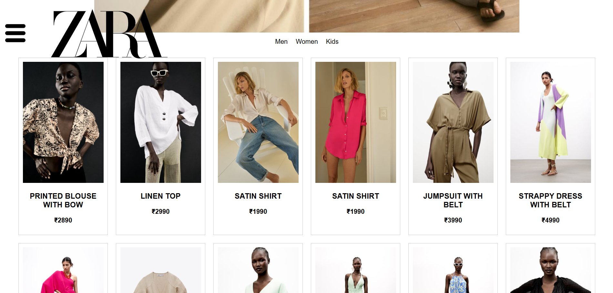
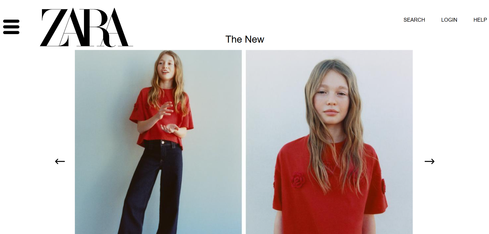
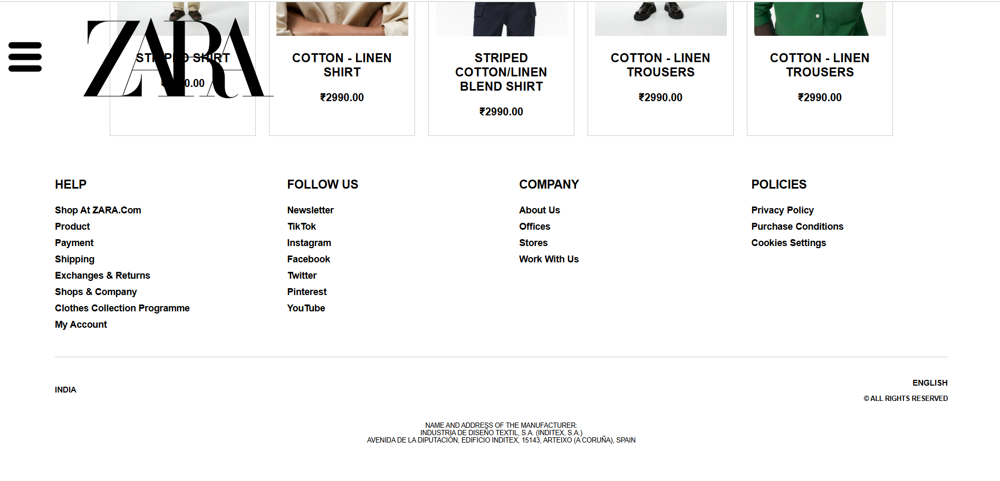

# Zara Clone - React

This is a **frontend-only Zara clone** built using **React.js**. It mimics the UI and functionality of the official Zara website, allowing users to browse products based on categories like **Men, Women, and Kids**.

## 🚀 Live Demo
|  |  |
|----------------------------------|----------------------------------|
|  |  |
|  |  |      
   

---

## 📌 Features
✅ **Homepage** with Zara's product collection.  
✅ **Category-based Filtering** (Men, Women, Kids).  
✅ **Slideshow Animation** for featured images.  
✅ **Smooth Navigation** with React Router.  

---

## 🛠️ Technologies Used
- **React.js** (Frontend framework)
- **CSS** (For styling & animations)
- **JavaScript (ES6+)** (Logic & interactivity)
- **React Hooks** (`useState`, `useEffect`, `useRef`)
- **JSON File for Data** *(temporary product storage)*
